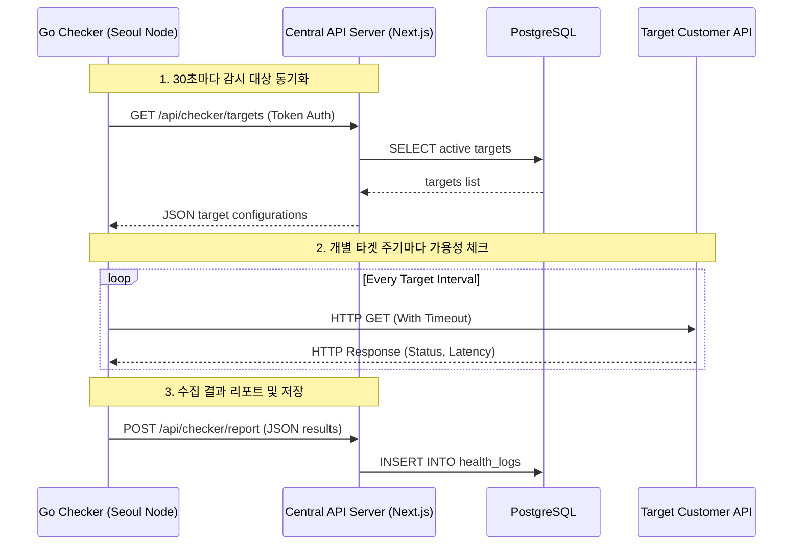
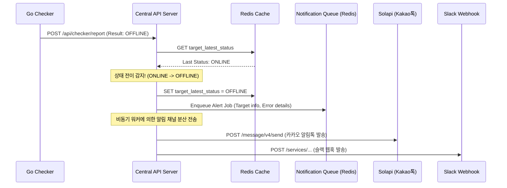

# [시스템 아키텍처 설계서] watchdog-hq: 시스템 아키텍처 설계서

본 문서는 상용 SaaS 가용성 모니터링 플랫폼 `watchdog-hq`의 물리적·논리적 시스템 아키텍처와 구성 요소 간의 데이터 통신 흐름, 리전별 분산 수집기 설계 및 확장 전략을 다루는 시스템 아키텍처 설계서입니다.

---

## 1. 아키텍처 개요 및 설계 원칙

1. **디커플링(Decoupling):** 사용자가 사용하는 웹 콘솔(Next.js)과 물리적 네트워크 상태를 점검하는 엔진(Go Checker)을 철저히 분리하여 상호 장애가 전파되지 않도록 설계합니다.
2. **신뢰성(Reliability) 및 다중화:** 단일 리전의 네트워크 일시 오류로 인한 허위 알림(False Alert)을 방지하기 위해 다중 리전 교차 검증 구조를 설계합니다.
3. **확장성(Scalability):** 모니터링 대상이 폭증하더라도 Go Checker 노드의 수평 확장(Scale-out)만으로 인프라 운영 비용을 최소화하며 처리 가능하도록 구성합니다.

---

## 2. 논리적 아키텍처 (Logical Layers)

```mermaid
graph TD
    subgraph Client Layer
        Browser[Client Browser - Next.js UI]
    end

    subgraph Presentation & Control Layer (Next.js / Vercel Edge)
        WebPortal[SaaS Web Console]
        APIServer[Central API Server]
    end

    subgraph Data & Storage Layer
        MainDB[(PostgreSQL - Supabase / RDS)]
        CacheDB[(Redis - Cache & Rate Limiting)]
    end

    subgraph Distributed Checker Layer (OCI / AWS VPS)
        CheckerSeoul[Go Checker - 서울 리전]
        CheckerUS[Go Checker - 미국 리전]
    end

    subgraph Third-Party Integration Layer
        Stripe[Stripe / Toss Payments Billing]
        Solapi[Solapi - Kakao Alimtalk & SMS]
        Webhooks[Slack / Discord Webhooks]
    end

    Browser <-->|HTTPS / JSON| WebPortal
    WebPortal <--> APIServer
    APIServer <-->|SQL| MainDB
    APIServer <-->|Key-Value| CacheDB
    
    CheckerSeoul <-->|HTTPS REST API / JSON| APIServer
    CheckerUS <-->|HTTPS REST API / JSON| APIServer
    
    APIServer -->|API Call| Stripe
    APIServer -->|API Call| Solapi
    APIServer -->|Webhook POST| Webhooks
```

---

## 3. 구성 요소별 핵심 역할

### 3.1 SaaS Web Portal & Central API Server (Next.js)
* **역할:** 고객 대시보드 UI를 제공하고, 사용자 인증(OAuth2/JWT)과 구독 빌링(Stripe) 결제 상태를 관리합니다.
* **통합 제어:** Go Checker 노드가 감시할 헬스체크 타겟 데이터셋을 반환하고, 노드가 수집해 온 가용성 결과를 전달받아 DB에 기록하며 알림을 최종 트리거합니다.

### 3.2 Go Checker Nodes (Go)
* **역할:** 웹 UI 서빙 없이 오직 가용성 측정만 수행하는 초경량 수집 엔진입니다.
* **동작 프로세스:** 
  1. 중앙 API 서버를 폴링하여 본인이 담당할 헬스체크 대상(URL, 타임아웃 초) 리스트를 가져옵니다.
  2. 주기(Interval)마다 대상 서버에 HTTP GET 요청을 보내 응답 속도(Latency)와 HTTP 상태 코드를 측정합니다.
  3. 측정 즉시 결과를 중앙 API 서버로 벌크 전송(Report)합니다.

### 3.3 Data & Storage (PostgreSQL & Redis)
* **PostgreSQL:** 테넌트(`user_id`)별로 엄격히 격리된 유저, 요금제 구독, 헬스체크 설정 정보 및 가용성 이력 로그 데이터를 영구 저장합니다.
* **Redis:** 각 요금제 등급별 API 호출 제한(Rate Limit)을 통제하고, 실시간 가용성 상태 전이(ONLINE ↔ OFFLINE)를 Checker 노드 보고 시점에 즉시 파악하기 위해 인메모리 세션/상태 캐시로 활용합니다.

### 3.4 분산 감시 노드 보안 통신 정책 (중앙 API 중계의 당위성)
SaaS 시스템 구조상, Go Checker 노드들은 외부 퍼블릭 클라우드 망에 분산되어 기동됩니다. 보안 및 시스템 안정성을 보장하기 위해 **Go Checker 노드들은 데이터베이스(PostgreSQL)에 직접 커넥션을 맺거나 접속 주소를 알지 못하도록 완전히 격리**합니다.

1. **보안적 이유 (Zero Trust DB):**
   * 만약 Checker 노드에 DB 접속 ID/PW를 주입해 둔다면, 외부 클라우드 리전에 기동 중인 수많은 노드 중 단 1대만 해킹당하더라도 전체 사용자 정보와 구독 결제 정보가 담긴 메인 PostgreSQL 데이터베이스가 통째로 노출되는 치명적인 보안 위협이 발생합니다.
   * 따라서 Checker 노드는 오직 중앙 웹 서버의 엔드포인트와 마스터 인증 토큰(`X-Checker-Token`)만 알고 통신하며, DB 접속 정보는 일절 소유하지 않습니다.
2. **네트워크 성능 및 포트 제한:**
   * 수십 개의 Checker가 분산된 상태로 원격 DB 포트(`5432`)에 직접 접속해 쓰기/읽기 커넥션을 때리면 DB의 동시 접속 한도(Connection Limit)가 즉각 초과되어 마비되거나 방화벽 통제가 극도로 비효율적이어집니다.
   * 모든 쿼리는 안전한 인메모리 커넥션 풀을 소유한 중앙 웹 서버가 대행함으로써 트래픽 병목을 단일 게이트웨이로 차단합니다.

---

## 4. 핵심 데이터 흐름 설계 (Data Flows)

### 4.1 헬스체크 대상 수집 및 측정 흐름 (Checker Polling Flow)



### 4.2 장애 전이 감지 및 알림 트리거 흐름 (Alert Transition Flow)



---

## 5. 인프라 확장 및 비용 최적화 전략 (Scaling Strategy)

1. **Vercel Serverless Edge 활용:** 웹 포털과 메인 API 서버는 Vercel의 서버리스 에지 함수를 사용하여 사용자가 몰려도 자동으로 트래픽을 감당하며, 사용하지 않는 평시에는 인프라 기본 유지 비용이 $0에 가깝습니다.
2. **Checker 노드의 수평 확장:** 헬스체크 대상 도메인이 수만 개로 증가하면, 중앙 웹 서버를 스케일업할 필요 없이 월 $3.5 수준의 가벼운 VPS(Oracle Free Tier, LightSail 등) 인스턴스를 추가 개설하고 Go Checker 바이너리를 띄워주기만 하면 처리가 완료됩니다.
3. **Database 파티셔닝:** 가용성 로그(`health_logs`)는 매달 수천만 건 이상 누적될 수 있습니다. 이를 효율적으로 관리하기 위해 요금제 등급별 보존 기간(예: 14일, 30일, 90일)에 따라 데이터를 자동 아카이빙/딜리트하고 월 단위로 테이블 파티셔닝을 설계하여 DB 쿼리 성능을 유지합니다.
