# [데이터베이스 설계서] watchdog-hq: 데이터베이스 설계서

본 문서는 상용 SaaS 가용성 모니터링 플랫폼 `watchdog-hq`의 PostgreSQL 기반 멀티테넌트(Multi-tenant) 관계형 데이터베이스 설계서입니다. 사용자별 데이터 격리, 정기 결제 상태 매핑, 대용량 로그 누적에 대응하는 인덱싱 및 파티셔닝 전략을 다룹니다.

---

## 1. 개요 및 스토리지 설계 정책

1. **테넌트 분리 (Tenant Isolation):** 공동 DB 환경에서 타인의 설정이나 로그가 절대 섞이지 않도록 모든 핵심 테이블은 `users.id`를 외래키(`user_id`)로 참조하고 조회의 필터 기준으로 삼습니다.
2. **참조 무결성 (Referential Integrity):** 사용자가 회원 탈퇴하거나 특정 감시 대상을 삭제하면 관련 설정 및 로그도 연쇄적으로 삭제되도록 `ON DELETE CASCADE` 제약조건을 적극 적용합니다.
3. **대용량 데이터 대응:** 가용성 로그(`health_logs`) 테이블은 데이터가 매우 빠르게 누적되므로 복합 인덱스를 구성하여 성능 저하를 방지합니다.

---

## 2. 데이터베이스 개체 관계도 (ERD)

```mermaid
erDiagram
    users ||--o| subscriptions : "has"
    users ||--o{ health_targets : "manages"
    users ||--o{ alert_channels : "configures"
    health_targets ||--o{ health_logs : "records"

    users {
        uuid id PK
        string email UK
        string name
        timestamp created_at
    }

    subscriptions {
        uuid id PK
        uuid user_id FK,UK
        string stripe_customer_id
        string plan_tier "Free / Starter / Professional"
        string status "active / trialing / canceled"
        timestamp expires_at
    }

    health_targets {
        bigint id PK
        uuid user_id FK
        string name
        string url
        integer interval_seconds
        integer timeout_seconds
        boolean is_active
        timestamp created_at
    }

    alert_channels {
        bigint id PK
        uuid user_id FK
        string channel_type "slack / discord / SMS"
        string destination "Webhook URL or Phone Number"
        boolean is_verified
    }

    health_logs {
        bigint id PK
        bigint target_id FK
        integer status_code
        integer latency_ms
        boolean is_success
        string error_message
        timestamp timestamp
    }
```



---

## 3. 테이블 상세 설계 및 DDL 명세

PostgreSQL 표준 DDL 및 각 컬럼의 상세 명세서입니다.

### 3.1 `users` 테이블 (사용자 계정)
* **설명:** 소셜 가입자 및 기본 회원 계정을 관리합니다. Next-Auth 등의 인증 라이브러리와 유기적으로 호환되도록 구성합니다.
```sql
CREATE TABLE users (
    id UUID PRIMARY KEY DEFAULT gen_random_uuid(),
    email VARCHAR(255) UNIQUE NOT NULL,
    name VARCHAR(100),
    created_at TIMESTAMP WITH TIME ZONE DEFAULT CURRENT_TIMESTAMP NOT NULL
);
```

### 3.2 `subscriptions` 테이블 (결제 및 요금제)
* **설명:** 유저의 구독 상태 및 가입 등급을 저장합니다. Stripe 웹훅 연동 시 수시로 업데이트되는 영역입니다.
```sql
CREATE TABLE subscriptions (
    id UUID PRIMARY KEY DEFAULT gen_random_uuid(),
    user_id UUID UNIQUE NOT NULL REFERENCES users(id) ON DELETE CASCADE,
    stripe_customer_id VARCHAR(255),
    plan_tier VARCHAR(50) DEFAULT 'Free' NOT NULL, -- Free, Starter, Professional
    status VARCHAR(50) DEFAULT 'active' NOT NULL,  -- active, canceled, past_due
    expires_at TIMESTAMP WITH TIME ZONE,
    updated_at TIMESTAMP WITH TIME ZONE DEFAULT CURRENT_TIMESTAMP NOT NULL
);
```

### 3.3 `health_targets` 테이블 (가용성 점검 대상)
* **설명:** 모니터링할 외부 서비스 명칭과 URL 설정을 보관합니다.
```sql
CREATE TABLE health_targets (
    id BIGSERIAL PRIMARY KEY,
    user_id UUID NOT NULL REFERENCES users(id) ON DELETE CASCADE,
    name VARCHAR(100) NOT NULL,
    url TEXT NOT NULL,
    interval_seconds INTEGER DEFAULT 60 NOT NULL,
    timeout_seconds INTEGER DEFAULT 5 NOT NULL,
    is_active BOOLEAN DEFAULT TRUE NOT NULL,
    created_at TIMESTAMP WITH TIME ZONE DEFAULT CURRENT_TIMESTAMP NOT NULL
);

-- 사용자별 타겟 조회를 위한 인덱스
CREATE INDEX idx_health_targets_user_id ON health_targets(user_id);
```

### 3.4 `alert_channels` 테이블 (알림 수신처)
* **설명:** 장애 감지 시 쏠 슬랙 웹훅 주소 및 휴대폰 번호를 기록합니다.
```sql
CREATE TABLE alert_channels (
    id BIGSERIAL PRIMARY KEY,
    user_id UUID NOT NULL REFERENCES users(id) ON DELETE CASCADE,
    channel_type VARCHAR(20) NOT NULL, -- 'slack', 'discord', 'SMS'
    destination TEXT NOT NULL,         -- Webhook URL 또는 휴대폰 번호
    is_verified BOOLEAN DEFAULT TRUE NOT NULL, -- SMS의 경우 인증코드 확인 여부
    created_at TIMESTAMP WITH TIME ZONE DEFAULT CURRENT_TIMESTAMP NOT NULL
);

CREATE INDEX idx_alert_channels_user_id ON alert_channels(user_id);
```

### 3.5 `health_logs` 테이블 (가용성 측정 이력)
* **설명:** Go Checker가 수집한 모든 점검 결과를 기록하는 가장 쓰기가 많은 대용량 테이블입니다.
```sql
CREATE TABLE health_logs (
    id BIGSERIAL,
    target_id BIGINT NOT NULL REFERENCES health_targets(id) ON DELETE CASCADE,
    status_code INTEGER,
    latency_ms INTEGER DEFAULT 0 NOT NULL,
    is_success BOOLEAN NOT NULL,
    error_message TEXT,
    timestamp TIMESTAMP WITH TIME ZONE DEFAULT CURRENT_TIMESTAMP NOT NULL,
    PRIMARY KEY (id, timestamp) -- 파티셔닝 고려 복합 키 구성
) PARTITION BY RANGE (timestamp);
```
> [!NOTE]
> `health_logs` 테이블은 대용량 조회를 빠르게 수행하기 위해 아래와 같이 **복합 인덱스**를 필수로 추가합니다.
> ```sql
> -- 특정 대상의 최근 10회 히스토리 및 최근 상태를 고속 조회하기 위한 인덱스
> CREATE INDEX idx_health_logs_target_time ON health_logs(target_id, timestamp DESC);
> ```

---

## 4. 데이터 보존 정책 및 파티셔닝 전략

`health_logs`는 1초에 수백 건씩 데이터가 적재될 수 있으므로, 단일 테이블로 방치하면 인덱스 크기가 RAM 크기를 초과하여 시스템 전체가 뻗을 수 있습니다.

1. **테이블 파티셔닝 (Table Partitioning):**
   * `health_logs` 테이블을 **월 단위(Range Partitioning)**로 분할하여 관리합니다.
   * 예: `health_logs_2026_07`, `health_logs_2026_08` 등으로 물리 분할하여 조회 범위를 최소화합니다.
2. **데이터 자동 삭제 정책 (Data Retention Policy):**
   * `subscriptions.plan_tier` 등급에 따라 보존 주기(1일, 30일, 90일)가 지나 만료된 로그는 매일 새벽 백그라운드 크론탭(Cron)이나 배치 고루틴을 실행하여 하위 파티션 테이블 단위로 `DROP PARTITION` 처리하거나 만료 행을 자동 클리닝합니다.
